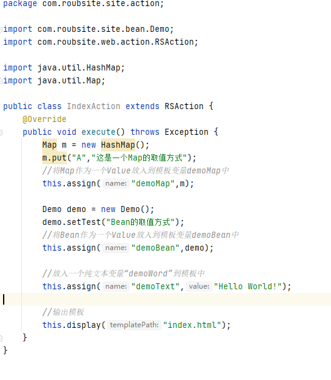

# RoubSite
**如果你喜欢这个项目，请给它一个star**  
[](https://github.com/lonesafe/roubsite/blob/master/LICENSE)
[](https://github.com/lonesafe/roubsite/stargazers)
[](https://www.javadoc.io/doc/com.roubsite/RoubSiteFramework)
[](https://maven-badges.herokuapp.com/maven-central/com.roubsite/RoubSite)
[](https://www.travis-ci.org/lonesafe/roubsite)
[](https://gitee.com/lonesafe/RoubSite)

## 介绍
RoubSite是一个简单、轻量、易上手的java web开发框架，项目研发的初衷是写一个可以让刚入行的程序猿快速掌握java web开发的这么一个框架。  
🔥🔥RoubSiteAdmin是基于RoubSite开发的一套后台权限管理框架，用户、角色、权限、菜单一整套都写好了，结合代码生成机，简单增删改查，通过配置就可以搞定。  
[官网https://www.roubsite.com](https://www.roubsite.com)
## RoubSiteAdmin演示地址
[🔥🔥RoubSiteAdmin后台管理框架](https://test.roubsite.com)  
账号：admin   密码：admin
## RoubSite框架使用Demo
[🔥🔥RoubSite框架Demo：https://gitee.com/lonesafe/roubsite-demo](https://gitee.com/lonesafe/roubsite-demo)  
## 软件架构
整个框架分为Action（前端控制器）、Dao（数据访问层）、Bean（实体类）这三层；  
页面模板实现了类似PHP中的smarty框架的一个模板引擎，使用起来十分方便。
## 快速开始
### 添加maven依赖
Smarty是框架的依赖项，会自动引入。  
引入框架（必须）：
```xml
<dependency>
  <groupId>com.roubsite</groupId>
  <artifactId>RoubSiteFramework</artifactId>
  <version>3.2.1</version>
  <type>pom</type>
</dependency>
```
引入权限管理（可选）：
```xml
<dependency>
  <groupId>com.roubsite</groupId>
  <artifactId>RoubSiteSecurity</artifactId>
  <version>3.2.1</version>
  <type>pom</type>
</dependency>
```
引入代码生成机（可选）：
```xml
<dependency>
  <groupId>com.roubsite</groupId>
  <artifactId>RoubSiteCodeSign</artifactId>
  <version>3.2.1</version>
  <type>pom</type>
</dependency>
```
### 配置web.xml
```xml
<!-- log4j配置 -->
<context-param>
    <param-name>log4jConfigLocation</param-name>
    <param-value>classpath:log4j.properties</param-value>
</context-param>
<!-- 引入RoubSite框架监听器 -->
<listener>
    <listener-class>com.roubsite.web.listener.RSConfigListenerContext</listener-class>
</listener>
```
### 加入配置文件
配置文件放置在resources中
#### config.properties(必须)
```properties
#默认访问分组名
default.group=index

#项目模块包名(定义方法：global.group.模块=包名)
global.group.index=com.roubsite.site
#项目分组根包名END

#静态资源后缀(框架将不对该文件进行解析)
global.static_suffix=*.jpg,*.css,*.png,*.js,*.gif,*.swf,*.ico,*.rar,*.woff,*.ttf,*.eot,*.map,*.woff2,*.xml,*.json,*.html
#数据库池监控（druid）
DataSourcePool.console=true
```
#### dataSource.properties(必须)
```properties
#数据库类型（1：mysql；2：oracle）
#dataSource2.type=1
#dataSource2.driverClassName=com.mysql.jdbc.Driver
#dataSource2.url=jdbc:mysql://127.0.0.1:3306/demo?useUnicode=true&characterEncoding=UTF-8&zeroDateTimeBehavior=convertToNull&autoReconnect=true
#dataSource2.username=root
#dataSource2.password=root
#dataSource2.poolSize= 12

#数据库类型（1：mysql；2：oracle）
dataSource.type=2
dataSource.driverClassName=oracle.jdbc.driver.OracleDriver
dataSource.url=jdbc:oracle:thin:@10.10.18.17:1521:orcl
dataSource.username=demo
dataSource.password=demo
dataSource.poolSize=  12
```
#### log4j.properties(必须)
```properties
LOG_DIR=D:/RoubSite-log/demo

log4j.rootCategory=DEBUG,ROOT_LOG
log4j.appender.ROOT_LOG= org.apache.log4j.FileAppender 
log4j.appender.ROOT_LOG.layout= org.apache.log4j.PatternLayout 
log4j.appender.ROOT_LOG.layout.ConversionPattern= [%-5p][%-22d{yyyy/MM/dd HH:mm:ssS}]%n%m%n 
log4j.appender.ROOT_LOG.Append= TRUE 
log4j.appender.ROOT_LOG.File= ${LOG_DIR}/root.log 
log4j.appender.ROOT_LOG.Encoding= UTF-8 

log4j.category.com.roubsite.web=DEBUG,ROUBSITE_FRAMEWORK
#框架日志
log4j.appender.ROUBSITE_FRAMEWORK= org.apache.log4j.FileAppender 
log4j.appender.ROUBSITE_FRAMEWORK.layout= org.apache.log4j.PatternLayout 
log4j.appender.ROUBSITE_FRAMEWORK.layout.ConversionPattern= [%-5p][%-22d{yyyy/MM/dd HH:mm:ssS}]%n%m%n 
log4j.appender.ROUBSITE_FRAMEWORK.Append= TRUE 
log4j.appender.ROUBSITE_FRAMEWORK.File= ${LOG_DIR}/roubsite_framework.log 
log4j.appender.ROUBSITE_FRAMEWORK.Encoding= UTF-8 


log4j.category.com.roubsite.database=DEBUG,ROUBSITE_DATABASE
#数据库日志
log4j.appender.ROUBSITE_SECURITY= org.apache.log4j.FileAppender 
log4j.appender.ROUBSITE_SECURITY.layout= org.apache.log4j.PatternLayout 
log4j.appender.ROUBSITE_SECURITY.layout.ConversionPattern= [%-5p][%-22d{yyyy/MM/dd HH:mm:ssS}]%n%m%n 
log4j.appender.ROUBSITE_SECURITY.Append= TRUE 
log4j.appender.ROUBSITE_SECURITY.File= ${LOG_DIR}/roubsite_security.log 
log4j.appender.ROUBSITE_SECURITY.Encoding= UTF-8 

log4j.category.com.roubsite.security=DEBUG,ROUBSITE_SECURITY
#权限管理日志
log4j.appender.ROUBSITE_DATABASE= org.apache.log4j.FileAppender 
log4j.appender.ROUBSITE_DATABASE.layout= org.apache.log4j.PatternLayout 
log4j.appender.ROUBSITE_DATABASE.layout.ConversionPattern= [%-5p][%-22d{yyyy/MM/dd HH:mm:ssS}]%n%m%n 
log4j.appender.ROUBSITE_DATABASE.Append= TRUE 
log4j.appender.ROUBSITE_DATABASE.File= ${LOG_DIR}/roubsite_database.log 
log4j.appender.ROUBSITE_DATABASE.Encoding= UTF-8 


log4j.category.org.activiti=DEBUG,ROUBSITE_ACTIVITI
#activiti日志
log4j.appender.ROUBSITE_ACTIVITI= org.apache.log4j.FileAppender 
log4j.appender.ROUBSITE_ACTIVITI.layout= org.apache.log4j.PatternLayout 
log4j.appender.ROUBSITE_ACTIVITI.layout.ConversionPattern= [%-5p][%-22d{yyyy/MM/dd HH:mm:ssS}]%n%m%n 
log4j.appender.ROUBSITE_ACTIVITI.Append= TRUE 
log4j.appender.ROUBSITE_ACTIVITI.File= ${LOG_DIR}/roubsite_database.log 
log4j.appender.ROUBSITE_ACTIVITI.Encoding= UTF-8 

log4j.rootLogger=DEBUG,A1
#输出到控制台A2
log4j.appender.A1= org.apache.log4j.ConsoleAppender 
log4j.appender.A1.layout= org.apache.log4j.PatternLayout 
log4j.appender.A1.layout.ConversionPattern= %n%m%n 
log4j.appender.A1.Target= System.out 
```
#### smarty4j.properties(必须)
```properties
#-----------------模板配置---------------------
#调试模式，模板文件更新将自动重新加载
debug=true
#启用cache，如果遇到变量无法刷新的问题，请关闭缓存(cache=off)
cache=off
#模板文件编码集
encoding=UTF-8
#左边界定界符
left.delimiter={
#右边界定界符
right.delimiter=}
#函数扩展包的名称，以:分隔
package.function=com.roubsite.smarty4j.statement.function
#变量调节器扩展包的名称，以:分隔
package.modifier=com.roubsite.smarty4j.statement.modifier
```
#### security.properties(可选加入，如果引入了RoubSiteSecurity则需要该配置项)
```properties
security.class=com.roubsite.security.filter.SecurityFilter
security.missing=*.jpg,*.css,*.png,*.js,*.gif,*.swf,*.ico,*.rar,*.woff,*.ttf,*.eot,*.html
security.login.url=/admin/login
```
#### codeSign.properties(可选加入，如果引入了RoubSiteCodeSign则需要该配置项)
```properties
#------------------代码生成机配置----------------------
codeSign.outputPath=d:/demo
```
### hello world
复制上面的配置文件后，我们已经创建了一个模块“index”，根据配置文件我们知道“index”对应的包名
是“com.roubsite.site”，根据这个包名我们新建三个包“com.roubsite.site.action”、“com.roubsite.site.bean”、“com.roubsite.site.dao”，
这三个包名分别对应“控制器”、“数据库实体”、“数据库操作”。
我们在“com.roubsite.site.action”下创建一个继承“RSAction”的得类“IndexAction”，并且实现“execute”方法：  
  
然后在“src/webapp/templates/index”下面再添加一个模板文件“index.html”：  
  
然后启动tomcat访问即可看到效果（**_具体控制器和模板的对应关系、url和控制器的对应关系可以查看操作手册_**）

## RoubSite都包含那些模块

1.  RoubSiteFramework RoubSite框架，Action、Dao的代码实现都在里面。
2.  RoubSiteSecurity 权限管理，在Action中使用注解方式对方法进行权限控制，自己写权限管理可以不用它。
3.  RoubSiteSmarty4j 模板解释器，参考了github上的代码，原作者实在是没找到。
4.  RoubSiteCodeSign 代码生成机，这可是一个重头戏，它可以直接将数据库的表生成对应的增删改查的代码，页面也同时生成，减少工作量的首选。(`页面需要加群获取`)
5.  RoubSiteAdmin 一个完整的后台管理框架，可以直接拿来用，权限啥的都写好了（`加群获取`）

## RoubSite框架讨论QQ群1022159442
群里提供使用手册和教程哦